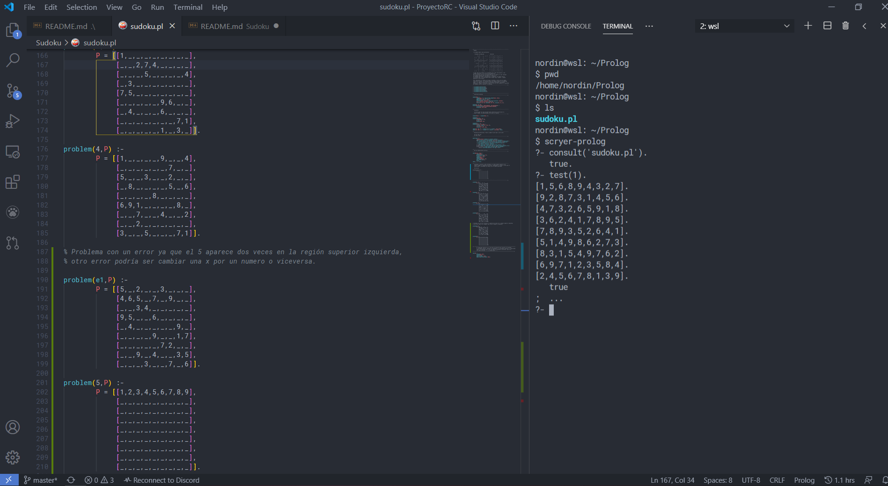

# Sudoku en Scryer-Prolog

* [Descripción del problema](#descripción-del-problema)

* [Funcionamiento del código](#funcionamiento-del-código)
  * [Librerias necesarias](#añadimos-las-librerías-necesarias)
  * [Predicado Sudoku](#predicado-que-resuelve-el-sudoku)
  * [Estructura del tablero](#estructura-del-tablero)
  * [Uso del programa](#uso-del-programa)
* [Ejecutar Scryer-Prolog](#ejecutar-scryer-prolog)

## Descripción del problema

El código con su explicación lo puede encontrar en [sudoku.pl](https://github.com/nordin-lab/ProyectoRC/blob/master/Sudoku/sudoku.pl). El problema ha sido sacado de [The Power of Prolog](https://www.metalevel.at/prolog).

  El sudoku tendrá esta estructura:  

    Problema introducido             Solución

    .  .  4 | 8  .  . | .  1  7     9  3  4 | 8  2  5 | 6  1  7	     
            |         |                     |         |
    6  7  . | 9  .  . | .  .  .     6  7  2 | 9  1  4 | 8  5  3
            |         |                     |         |
    5  .  8 | .  3  . | .  .  4     5  1  8 | 6  3  7 | 9  2  4
    --------+---------+--------     --------+---------+--------
    3  .  . | 7  4  . | 1  .  .     3  2  5 | 7  4  8 | 1  6  9
            |         |                     |         |
    .  6  9 | .  .  . | 7  8  .     4  6  9 | 1  5  3 | 7  8  2
            |         |                     |         |
    .  .  1 | .  6  9 | .  .  5     7  8  1 | 2  6  9 | 4  3  5
    --------+---------+--------     --------+---------+--------
    1  .  . | .  8  . | 3  .  6     1  9  7 | 5  8  2 | 3  4  6
            |         |                     |         |
    .  .  . | .  .  6 | .  9  1     8  5  3 | 4  7  6 | 2  9  1
            |         |                     |         |
    2  4  . | .  .  1 | 5  .  .     2  4  6 | 3  9  1 | 5  7  8

 A cada lugar del tablero le corresponte una línea (horizontal) y una
 columna (vertical) a la vez que una región 3x3.
 En la situación inicial nos encontramos con un tablero aún por rellenar
 con algunos digitos que van desde el 1 hasta el 9.
 El problema que surge a continuación es completar los huecos vacíos 
 con dígitos del 1 al 9 de manera que en cada línea, columna  y región
 aparezca un solo dígito.

 Para representar el Sudoku en Prolog lo haremos a través de una simple
 lista de 81 dígitos. La introduciremos con algunos dígitos y el programa
 deberá ser capaz de devolvernos las posibles soluciones. Es posible
 añadirle el sudoku a solicionar tanto a través de este código en el apartado
 de ejemplos como al ejecutar el programa.

## Funcionamiento del código

### Añadimos las librerías necesarias

~~~
:- use_module(library(clpz)).
:- use_module(library(lists)).
:- use_module(library(format)).
:- use_module(library(dcgs)).
:- use_module(library(freeze)).
:- use_module(library(charsio)).
~~~

### Predicado que resuelve el Sudoku

~~~
sudoku(Rows) :-
        length(Rows, 9), maplist(same_length(Rows), Rows),
        append(Rows, Vs), Vs ins 1..9,
        maplist(all_distinct, Rows),
        transpose(Rows, Columns), maplist(all_distinct, Columns),
        Rows = [As,Bs,Cs,Ds,Es,Fs,Gs,Hs,Is],
        blocks(As, Bs, Cs), blocks(Ds, Es, Fs), blocks(Gs, Hs, Is).

blocks([], [], []).
blocks([N1,N2,N3|Ns1], [N4,N5,N6|Ns2], [N7,N8,N9|Ns3]) :-
        all_distinct([N1,N2,N3,N4,N5,N6,N7,N8,N9]),
        blocks(Ns1, Ns2, Ns3)
~~~

Resolver un Sudoku, de primeras, puede parecer un programa muy complejo. Pero con Prolog y más especificamente Scryer-Prolog basta con un par de predicados.
En el código de [sudoku.pl](https://github.com/nordin-lab/ProyectoRC/blob/master/Sudoku/sudoku.pl) encontrará también una breve explicación del código.

* Primero hacemos uso del predicado **length**, de esta forma nos aseguramos de que la longitud de la lista es de 9 variables.

>length(Rows, 9)

* Destacamos el uso del predicado **maplist**, que nos dice si se cumple cierto predicado que nosotros introduzcamos en una lista en concreto, por ejemplo:

>maplist(same_length(Rows), Rows),
>
>maplist(all_distinct, Rows)

Usa el predicado *same_length* el cual comprueba que la lista de filas *Rows* sea igual que la lista *Rows*, aunque pueda resultar algo redundante es necesario.
Luego vemos el uso de all_distinct el cuál es verdadero siempre que todos los elementos dados sean distintos y usa los elementos de la lista *Rows* que es donde se encuentran nuestras variables. Este predicado también es usado para las columnas, las cuales son extraemos de transponer las filas (una fila transpuesta es una columna).

>transpose(Rows, Columns), maplist(all_distinct, Columns),

* Luego debemos definir como serán las filas, columnas y regiones para ello:

>Rows = [As,Bs,Cs,Ds,Es,Fs,Gs,Hs,Is],
>
>blocks(As, Bs, Cs), blocks(Ds, Es, Fs), blocks(Gs, Hs, Is).

Aquí definimos las filas (o columnas) y las dividimos en 3 bloques, ya que es un sudoku 9x9, este tiene 3 regiones que corresponden a las filas y 3 correspondientes a cada columna (al inicio de este documento se puede apreciar gráficamente).
Para dividirlo en bloques usa el predicado *blocks* que definieremos a continuación.

>blocks([], [], []).
>
>blocks([N1,N2,N3|Ns1], [N4,N5,N6|Ns2], [N7,N8,N9|Ns3]) :-
>
>all_distinct([N1,N2,N3,N4,N5,N6,N7,N8,N9]),
>
>blocks(Ns1, Ns2, Ns3).

Primero definimos el "caso base", como será el bloque que estará compuesto por 3 listas, luego hacemos uso del [Cabeza|Resto], de esta forma nos quedamos con los 3 primero elementos de la lista. A continuación volvemos a hacer uso de *all_distinct* para que cada elemento sea distinto para posteriormente completar cada región del bloque.

### Estructura del tablero

Para introducir un nuevo tablero bastaría con copiar y pegar la siguiente estructura, añadiendole un numero o letra que lo identifique y rellenando los huecos con el numero que desee.
~~~
problem(numero,P) :-

        P = [[_,_,_,_,_,_,_,_,_],
             [_,_,_,_,_,_,_,_,_],
             [_,_,_,_,_,_,_,_,_],
             [_,_,_,_,_,_,_,_,_],
             [_,_,_,_,_,_,_,_,_],
             [_,_,_,_,_,_,_,_,_],
             [_,_,_,_,_,_,_,_,_],
             [_,_,_,_,_,_,_,_,_],
             [_,_,_,_,_,_,_,_,_]].
~~~

Si introduce un tablero que no tenga solución, o posea algún dato corrupto como una *x* el programa le devolverá que no tiene solución.

### Uso del programa

Le he añadido un predicado **test(N)** que es el único que se necesita usar para resolver el problema, si introduce **test(4)**, resolverá el problema 4. Si introduce **test(N)** irá resolviendo todos los problemas uno a uno con todas las posibles soluciones, para ello solo debe presionar ";" y si desea parar ".".
~~~
test(N) :-
        problem(N, Rows),
        sudoku(Rows),
        maplist(label, Rows),
        maplist(portray_clause, Rows).
~~~

Para poder ejecutar este problema, o cualquiera de la web de Markus Triska necesita Scryer-Prolog, a continuación verá como hacerlo de forma sencilla.

## Ejecutar Scryer-Prolog

Para ejecutar Scryer-Prolog tal y como haremos a continuación necesitas WSL 2 y Docker, para instarlo puede seguir cualquier guía: [link1](https://www.youtube.com/watch?v=_fntjriRe48), [link2](https://www.youtube.com/watch?v=idW-an99TAM).

Para cualquier duda en el uso de Docker con WSL 2: [Docker en WSL2](https://docs.docker.com/docker-for-windows/wsl/).

Una vez el entorno de desarrollo está en funcionamiento, con Docker activado para WSL 2 y con nuestra cuenta iniciada, faltaría poder ejecutar [Scryer-Prolog](https://github.com/mthom/scryer-prolog). Puede hacerlo como explica en el enlace anterior, o si prefiere poder hacerlo de forma local sin tener que introducir comandos cada vez que desee ejecutar un programa solo necesita hacer un **pull** de la imagen del programa que reside en docker, en el terminal *wsl*:

>docker pull mjt128/scryer-prolog

Una vez ha descargado la imagen, podrá ejecutar Scryer-Prolog desde el terminal sin necesidad de tener Docker activado (cabe destacar que para realizar el pull debe tener docker encendido con su cuenta).

Para ejecutarlo basta con introducir el comando:

>scryer-prolog

Para que el programa funcione bien con nuestros archivos deberá ubicar los archivos *.pl* en un directorio de nuestro sistema operativo linux que hayamos instalado, por ejemplo, yo lo he localizado en /home/nordin/Prolog.

Puede escribir el programa con cualquier editor de texto que crea conveniente tanto desde la terminal, como *nano* *vim* *joe* entre otros, o el mismo *vs code*. Siempre y cuando al hacer el consult() indiquemos la ubicación del archivo en cuestión.

También podría considerar interesante incluir un terminal más vistoso como [este](https://www.youtube.com/watch?v=kY4Ns260i2k).

