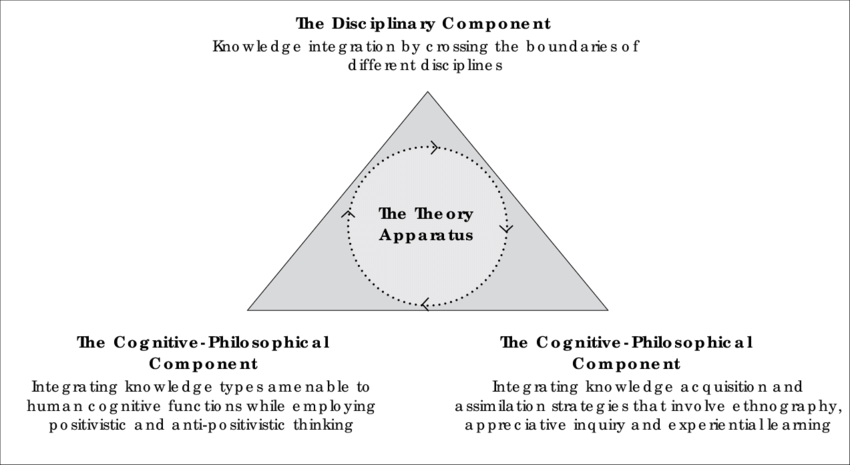
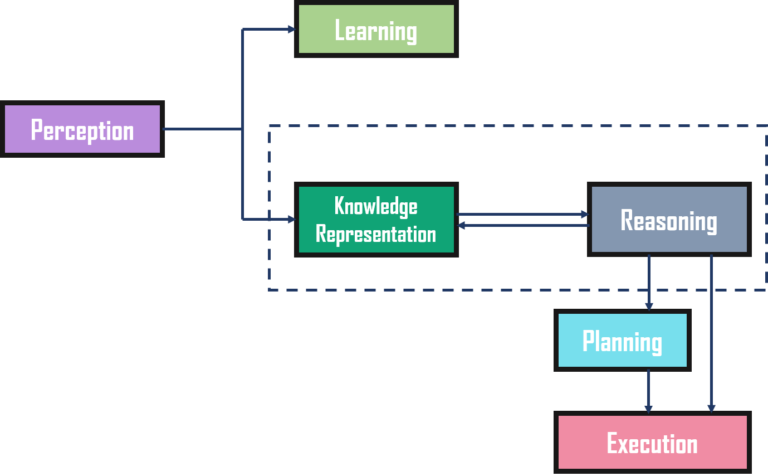
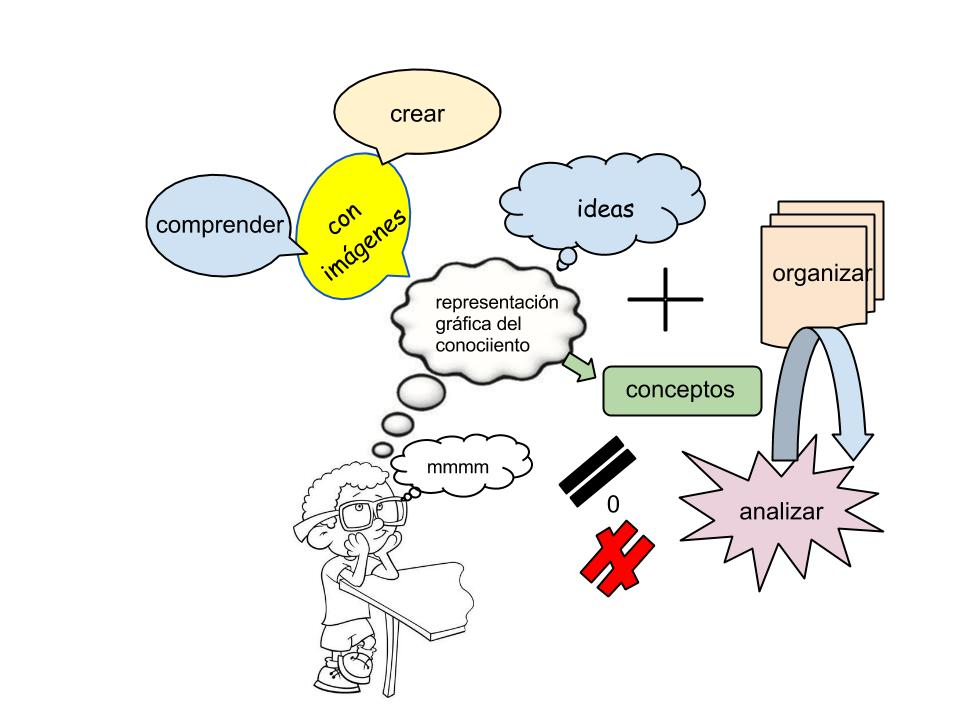
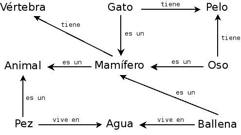
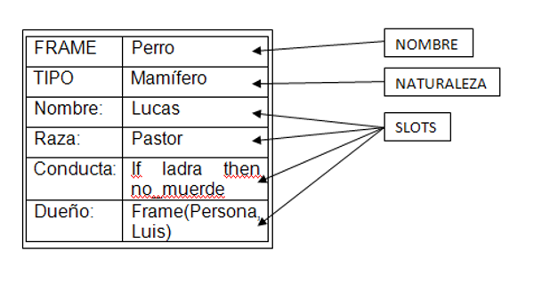
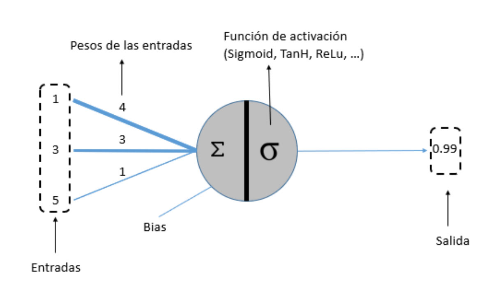
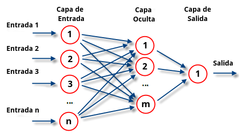

# Representación del conocimiento en Inteligencia Articial

Si en algo podemos caracterizarnos los seres humanos es en entender, razonar e interpretar el entorno, la cuestión es: ¿Como hacer que una máquina actúe como nosotros?

En respuesta a esta pregunta surge la *Representación del conocimiento*, situándola pues como uno de los pilares fundamentales de  la Inteligencia Artificial.

* [Introducción](##introducción)
* [Objetivo](##objetivo)
* [Representación del conocimiento en IA](##representación-del-conocimiento-en-ia)
* [Técnicas de representación del conocimiento](##técnicas-de-representación-del-conocimiento)

## Introducción

La representación del conocimiento es un área muy amplia que abarca tantos aspectos teóricos como los más puramente epistemológicos incluyendo problemas de enfoque práctico como el tratamiento de datos. A continuación trataeremos como la representación del conocimiento permite codificar el conocimiento humano de manera que este pueda ser usado computacionalmente, no se trata solo de guardar y tratar datos, sino de hacer posible que una máquina pueda aprender de estos y comportarse de manera inteligente, tal y como haría una ser humano.
Por lo general, podemos clasificar el conocimiento en tres tipos:

* Conocimiento declarativo

    Son hechos sobre objetos o situaciones. Estos poseen mayor capacidad expresiva, lo que a su vez produce una menor capacidad computacional. Es conocimiento pasivo expresado mediante sentencias acerca de los hechos del mundo que nos rodea.
    Este conocimiento puede ser representado con modelos relacionales y esquemas basados en lógica. Los modelos relacionales pueden ser representados en forma de árboles, grafos o redes semántica. Los esquemas de representación lógica incluyen el uso de lógica proposicional y lógica de predicados.

* Conocimiento procedimental

    Es aquel conocimiento compilado que se refiere a la forma de realizar cierta tarea, es decir, el saber como hacer algo. Por ejemplo, los pasos a seguir para resolver un problema de matemáticas.
    Están caracterizados por gramáticas formales, usualmente implantadas por sistemas o lenguajes procedimentales y sistemas basados en reglas.

* Conocimiento heurístico

    Es un tipo especial de conocimiento usado por los humanos para resolver problemas complejos. Está relacionado con la palabra griega *heuriskein* que significa descubrir. Entendemos por heurístico a un criterio, método, estrategia seguida para simplificar la solución de un problema.

## Objetivo

La representación del conocimiento deberia comprender y describir la riqueza del mundo. Sin embargo, en la práctica, el esfuerzo llevado a cabo en la investigación de éste se ha concentrado en desarrollar un conjunto de normas que la máquina debe realizar para llegar a un fin específico. Este fin proviene de la abstracción del conocimiento haciendo un examen minucioso del mundo real.
Con esto queremos decir que las técnicas y herramientas son básicas para el desarrollo sí, pero el verdadero reto se encuentra en entender y poder describir la riqueza que nos rodea.

## Representación del Conocimiento en IA

Para representar algo necesitamos saber:

* Su forma o estructura.
* El uso que le dan los seres inteligentes.
* El uso que le derá la inteligencia artificial.
* Como adquirir el conocimiento.
* Como almacenarlo y manipularlo.

En la actualidad no tenemos una respuesta completa a estas preguntas, no obstante, construiremos modelos que simulen la adquisición, estructuración y manipulación del conocimiento que nos permitan crear sistemas artificiales inteligentes.

Un esquema que muestre que elementos componen un sistema inteligente:

* Percepción: Encargada de recibir datos o información del entorno.
* Aprendizaje: El sistema debe ser capaz de aprender del entorno, de manera que el computador pueda aprender por el mismo sin necesidad de ser programado.
* Representación del conocimiento y razonamiento: El componente principal, encargado de enseñar a la máquina la inteligencia humana, el objetivo es que el agente en cuestión se comporte inteligentemente y como el razonamiento automatizado puede ir extrayendo la información del entorno conforme la vaya necesitando.
* Planificación y ejecución: El agente necesitará un plan, que consistirá en darle unas condiciones iniciales, efectos y una secuencia de acciones que lo lleven a su fin. Una vez este ha sido completado, el último paso será la ejecución del proceso final.

Los agentes que encontramos en estos sistemas pueden pues, conocer *solo* aquello que ha experimentado, por ejemplo, en *Prolog*:

Si preguntamos a Prolog si 1+1=2:

    ?- 2 is 1+1.
    Yes
Este nos responde sí ya se le ha dado tal conocimiento, si le preguntaramos si Lucas es un pato:

    ?- esPato(Lucas).
    No
Este nos dice que no ya que no se le ha dotado de ese conocimiento, no sabe ni qué es un pato ni conoce a un tal Lucas. Para darle ese conocimiento bastaría con expresarlo mediante un hecho (verdad incondicional) en un archivo con extensión *.pl* e introducirle esPato(Lucas). De esta forma si le volvieramos a preguntar:

    ?- esPato(Lucas).
    Yes
    ?- esPato(X).
    X = Lucas   
Incluso si le preguntamos por el nombre de un pato este nos responderá porque ya ha sido incluido en su *base de conocimiento*.

## Esquemas de Representación del Conocimiento

El principal objetivo de la representación del conocimiento es facilitar la extracción de conclusiones (inferencia) a partir del conocimiento, para ello, necesitamos
expresar el conocimiento en una forma computable.

La sintaxis describe las posibles formas de construir y combinar los elementos del lenguaje. Es decir, la sintaxis especifica cuál es el conjuntode sentencias de un lenguaje y qué combinaciones de sentencias son válidas. La semántica determina el significado de los elementos del lenguajey la relación entre estos y su referente en el dominio real. Es decir, lasemántica determina de manera no ambigua qué significa cada una delas sentencias del lenguaje.

Es importante destacar que los esquemas de representación van más allá de lasestructuras de datos o las bases de datos, las cuales se preocupan de maneraexclusiva de cómo almacenar y recuperar datos de manera eficiente. Interna-mente, la implementación de un esquema de representación puede utilizarestructuras de datos y bases de datos, pero tiene que añadir otras estructuras yprocesos que permitan hacer inferencia de conocimiento nuevo.

## Propiedades de un esquema de representación

Un buen esquema de representación del conocimiento debe ofrecer un acceso rápido y preciso al contenido
,así como las propiedades siguiente:

1. Representación apropiada. Debe tener la habilidad para representar todo el conocimiento que es necesario para el dominio en cuestión. Es decir, tiene que ser lo suficientemente rico como para contener los datos y la información mínima para dar una solución apropiada al problema.

2. Inferencia apropiada. Tiene que ser capaz demanipular las estructuras de la representación, de modo que en todo momento se puedan derivar nuevas estructuras asociadas con conocimiento nuevoinferido del antiguo.
3. Eficiencia inferencial. Debe mejorarel proceso de inferencia mediante la inclusión de heurísticas y guías que lo agilicen, para, de este modo, optimizar el cómputo. Por lo tanto, tiene que representar aquellas características del problema que puedan ser explotadas demanera computacional.
4. Eficiencia de adquisición. El esquema debe permitir la fácil incorporación del conocimiento nuevo.

Otras propiedades que conviene tener en cuenta son:

* Claridad. Facilidad de identificar el conocimiento representado.
* Naturalidad. Capacidad de representar el conocimiento en su forma más "natural", de manera que pequeños cambios en el problema requieran a su vez, pequeños cambios en el esquema.
* Modularidad. Posibilidad de fragmentar el conocimiento sin perder eficiencia ni eficacia.

## Etapas de la Representación del Conocimiento

Dado un problema complejo que requiere el uso intensivo de conocimiento,
podemos considerar las siguientes etapas en su resolución:

* El punto de partida es el problema que se quiere resolver, que marca cuál será el dominio de interés.
* La siguiente fase es la adquisición de conocimiento sobre el dominio de interés y el problema que se quiere resolver.
Obtener el conocimiento de un dominio es una tarea muy compleja que involucra capacidades de procesado de la información como por ejemplo percepción, comunicación,asociación y razonamiento. Es vital obtener todo el conocimiento relevan-te para el problema y evitar conocimiento superfluo. De este modo, evitaremos problemas (errores, malas interpretaciones, redundancias, informa-ción sobrante, dispersión, etc.), minimizaremos los errores y mejoraremos el rendimiento en el acceso a la información.
* Una vez obtenido el conocimiento del dominio, el paso siguiente es su codificación en un esquema apropiado. El tipo de codificación elegido y el modo como codificar la información condicionará hasta qué punto el conocimiento puede ser integrado con otras fuentes de información y compartido con terceros.
* Entonces, se aplica un motor de inferencia sobre el conocimiento guar-dado en el esquema de representación para extraer conclusiones sobre elproblema.•  
* Para comunicar el resultado, el último paso es la interpretación de las conclusiones obtenidas en términos de hechos del dominio. De este modo,obtenemos una solución al problema planteado inicialmente.

## Retos que plantea la representación del conocimiento

En las etapas anteriormente identificadas se nos plantea varias cuestiones como:

* ¿Cómo elegir cuál es el dominio relevante al problema? ¿Qué conocimiento queda dentro y fuera de la representación?
* Una vez elegido el dominio de interés, ¿cuánto conocimiento almacenar?
* ¿Cómo se adquiere éste?
* ¿Qué uso se le dará?
* A partir de todo esto, ¿cuál es el esquema de representación más adecuado para el problema?

Todas estas cuestiones nos sirven para darnos cuenta de lo complicado que será elegir una buena representación. Tenemos que hacer énfasis en que cuando hablamos de conocimiento, además de representarlo, no debemos olvidar en ningún momento que también deberemos procesarlo.Además de estas decisiones, que son particulares para cada problema, hay unaserie de retos más generales que aparecerán en cualquier problema de representación del conocimiento que consideremos: la imposibilidad de modelizarlo todo, el conocimiento de sentido común y el lenguaje natural. Antes de continuar, estudiaremos estos retos con más detalle.

* Problema de modelizar el mundo. El éxito con el que un problema pueda ser solucionado dependerá de nuestra habilidad para representar el conocimiento, sin olvidar que no trabajaremos sobre el mundo, sino una simplificación de este, que será imperfecta e incompleta.
* Problema del sentido común. Es díficil de aplicar en todas las situaciones, haciendonos a veces cometer errores. Si queremos evitar que un sistema inteligente cometa este tipo de errores, debemos codificar el conocimiento de sentido común relativo al problema, para ello tendremos en cuenta dos factores:

  * Existe gran cantidad de conocimiento de sentido común, por lo que debemos elegir un mínimo suficiente para la resolución del problema,
  * Este tipo de conocimiento suele darse por sabido, lo que hace muy fácil que lo pasemos por alto. Por lo que requerirá un esfuerzo adicional a la hora de especificarlo.

* Problema del lenguaje natural. El lenguaje que utilizamos se denomina lenguaje natural, muy alejado de los lenguajes formales usados en programación.
Posee gran expresividad que le permite representar cualquier elemento que imaginemos y ya gran cantidad de conocimiento está representado mediante este lenguaje.
Sin embargo, genera un gran inconveniente, la ambigüedad. Es decir, permite que una frase o palabra admita más de una interpretación posible. Este es el motivo por el que en programación es usado los lenguajes formales.

## Formalismos de Representación del Conocimiento

* [Lógica](###lógica) 
* [Reglas de producción](###reglas-de-producción)
* [Redes semánticas](##redes-semánticass)
* [Marcos](###marcos)
* [Redes neuronales](###redes-neuronales)

### Lógica

La lógica es la disciplina que estudia los métodos de formalización del conocimiento.
Para ello existen dosniveles de abstracción según el nivel de detalle que se quiera formalizar: *Lógica proposicional y lógica de predicados.*

* La lógica proposicional (o de enunciados) toma como base las frases declarativas simples o proposiciones que son aquellos elementos que pueden ser considerados como *verdaderos o falsos*
* La lógica de predicados estudia las frases declarativas con mayor grado de detalle, considerando la estructura interna de las proposiciones, tomando como elemento básico los objetos y las relaciones entre dichos objetos. Es decir, se distingue: **que se afirma** (predicado o relación) y **de quién se afirma**(objeto).

### Reglas de producción

Los sistemas de producción son uno de los mecanismo de representación del conocimiento más populares. Son reglas del tipo **Si-Entonces**. Ampliamente utilizados en sistemas expertos.

* Su estructura general es: **Antecedente => Consecuente**

El *antecedente* contiene las cláusulas que deben cumplirse para que la regla pueda evañuarse o ejecutarse. El *consecuente* indica las conclusiones que se deducen de las premisas o las acciones que el sistema debe realizar cuando ejecuta la regla.

Ejemplo: **IF** (coche COCHE-JUAN) AND (luces COCHE_JUAN ténues) **THEN** (verificar_batería COCHE-JUAN)

### Redes semánticas
Las redes semánticas son una alternativa a la lógica de predicados, están basadas en la idea de que loso bjetos o los conceptos pueden ser unidos por alguna relación.Estas relaciones se representan usando una liga que conecte dos conceptos.Los nodos y las ligas pueden ser cualquier cosa, dependiendo de la situación a modelar. Por ejemplo:

### Marcos
Un marco (frame), es una colección de atributos, que normalmente llamados ranuras (slots), con valores asociados (y posibles restricciones entre los valores), que describe alguna entidad del mundo, algunas veces el marco describe una entidad en un sentido absoluto, y en otras representa la entidad desde un punto de vista particular. Un frame único tomando independientemente no suele ser útil, en lugar de eso se constituyen sistemas de frames a partir de recolecciones de frames conectados unos con otros en virtud del hecho del que el valor de un atributo de un frame puede ser a su vez otro frame.

Su estructura es la siguiente:
* Nombre: El cuál debe ser único para diferenciarlos de los demás.
* Padre o Naturaleza: Equivale a la clase superior a la cual pertenece y es la que le permite el mecanismo de herencia.
* Slorts o Atributos: Constituye el cuerpo y cada uno representa una propiedad estándar o atributo del elemento representado.

### Redes neuronales
Las redes neuronales artificiales son un modelo inspirado en el funcionamiento del cerebro humano. Esta formado por un conjunto de nodos conocidos como neuronas artificiales que están conectadas y transmiten señales entre sí. Estas señales se transmiten desde la entrada hasta generar una salida.
Su estructura general es la siguiente:

¿Su objetivo? aprender modificándose automáticamente a si mismo de forma que puede llegar a realizar tareas complejas que no podrían ser realizadas mediante la clásica programación basada en reglas. De esta forma se pueden automatizar funciones que en un principio solo podrían ser realizadas por personas.

Como se ha mencionado el funcionamiento de las redes se asemeja al del cerebro humano. Las redes reciben una serie de valores de entrada y cada una de estas entradas llega a un nodo llamado neurona. Las neuronas de la red están a su vez agrupadas en capas que forman la red neuronal. Cada una de las neuronas de la red posee a su vez un peso, un valor numérico, con el que modifica la entrada recibida. Los nuevos valores obtenidos salen de las neuronas y continúan su camino por la red. Este funcionamiento puede observarse de forma esquemática en la siguiente imagen.

Una vez que se ha alcanzado el final de la red se obtiene una salida que será la predicción calculada por la red. Cuantas más capas posea la red y más compleja sea, también serán mas complejas las funciones que pueda realizar.